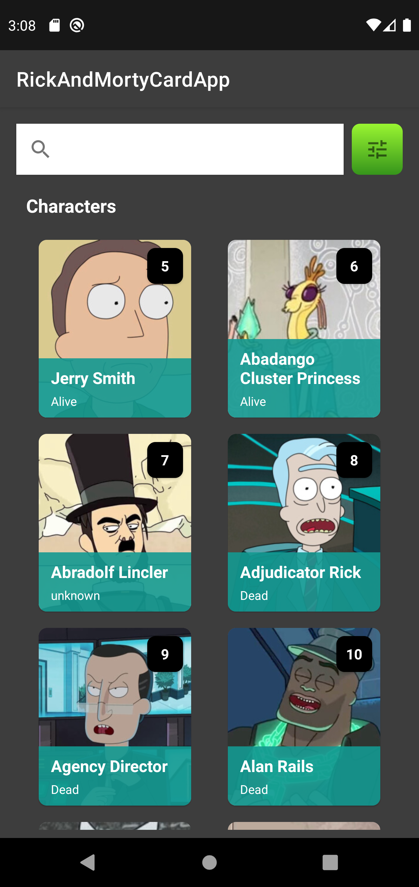
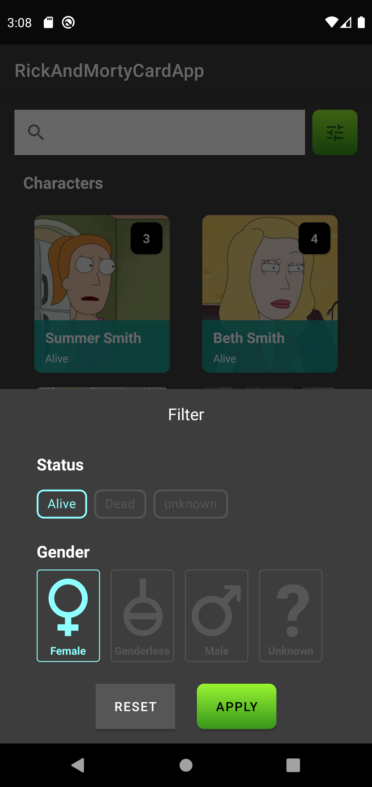
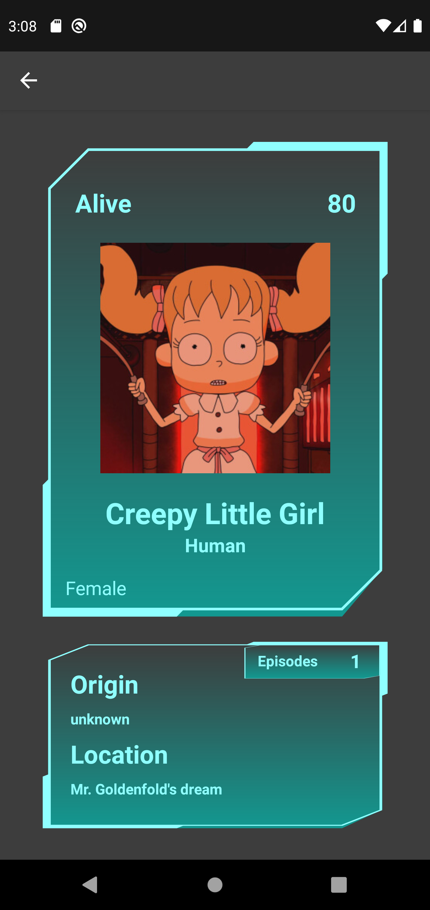

# Rick and Morty API

App to consume The Rick and Morty API in kotlin with a costum filter.

# System Requirements

- Clean Arch - DDD - Repository- UseCase- MVVM
- Unit Test - Junit - Mockk

- Android Studio
- Retrofit
- Navigation Component
- Picasso
- LiveData and ViewModel 
- Coroutines

# Features

- Get characters by: name, status or gender
- Get characters by pagination

# Credits
- [The Rick and Morty API](https://rickandmortyapi.com/)
